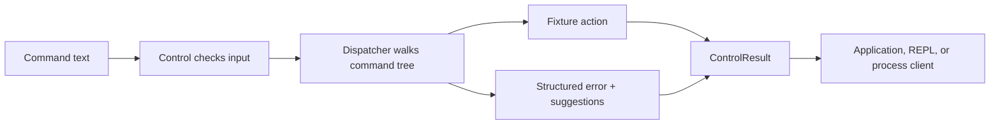

# command-router

Command Router is a small Python library for applications that accept textual commands. Define a command tree or load a
grammar file, convert input into typed arguments, and invoke the action attached to the matching path. The library keeps
syntax, application state, error details, completion, and process transports as separate pieces that can be used
together or independently.

The main user-facing features are:

- hand-built and fluent command trees with literals, typed arguments, choices, optionals, and greedy text;
- TOML and JSON5 grammar files for file-backed command surfaces;
- fixture classes that bind command names to application actions and state;
- structured parse, initialization, and execution results with useful expectations and partial arguments;
- prefix-first and typo-aware suggestions, including an optional HTTP suggestions endpoint;
- aliases and repeating modifier chains through redirect edges;
- embedded, interactive, and stdin/stdio service modes.

## How it works



`Control` handles the command prefix and execution lifecycle. The dispatcher handles tokenization and tree matching.
Fixtures supply actions and state. Every path returns a result that can be inspected directly or serialized for another
process.

## Run it

```sh
just -l         # see available recipes
just test       # run the test suite
just run        # start the router
just run -L     # start the router in lazy grammar mode
```

[Install `just`](https://just.systems/man/en/packages.html) if you don't have it yet.

## Documentation

Start with the [project documentation](https://gitlab.com/denniscxrpse/command-router/-/wikis/home). It explains the
command tree, fixture SDK, grammar files, structured response contracts, suggestions, redirects, service modes, and
the external consumer example.

## Mirrors

- Primary: https://gitlab.com/denniscxrpse/command-router
- Mirror: https://github.com/denniscxrpse/command-router
